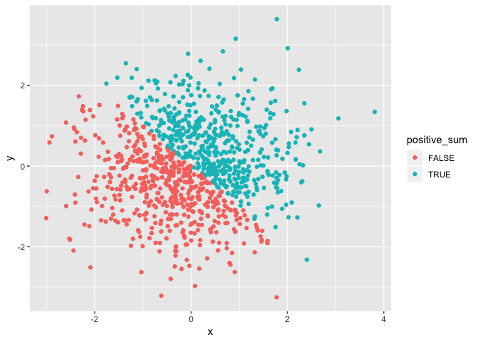
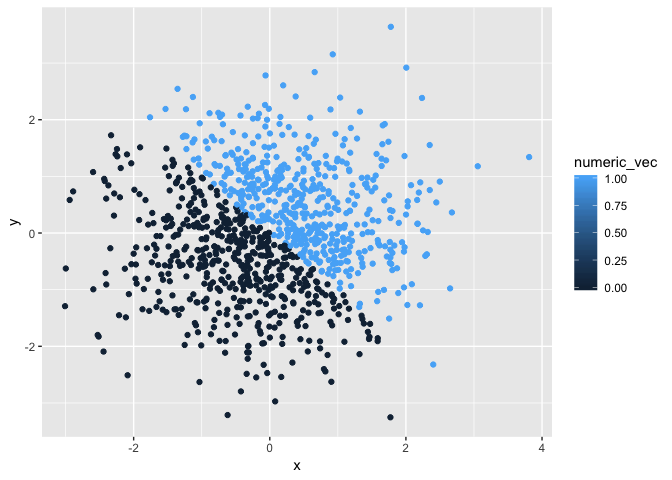
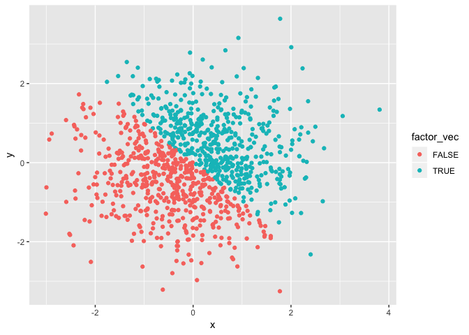

p8105\_hw1\_xy2395
================
Jack Yan
9/13/2018

Problem 1
=========

Creating a data frame with different variable types
---------------------------------------------------

First, try to create a data frame. The code chunk above creates a data frame comprised of:

1.  A random sample of size 10 from a uniform\[0, 5\] distribution;
2.  A logical vector indicating whether elements of the sample are greater than 2;
3.  A (length-10) character vector;
4.  A (length-10) factor vector.

``` r
set.seed(1)
random_sample = runif(10, 0, 5)  
logical_vec = random_sample > 2
char_vec = rep(c("a", "b", "c", "d", "e"), 2)
factor_vec = factor(rep(c(0, 1), 5), levels = c(0, 1))

#create a data frame from the 4 vectors above
data_frame = data.frame(random_sample, logical_vec, char_vec, factor_vec)

#show the data frame
data_frame
```

    ##    random_sample logical_vec char_vec factor_vec
    ## 1      1.3275433       FALSE        a          0
    ## 2      1.8606195       FALSE        b          1
    ## 3      2.8642668        TRUE        c          0
    ## 4      4.5410389        TRUE        d          1
    ## 5      1.0084097       FALSE        e          0
    ## 6      4.4919484        TRUE        a          1
    ## 7      4.7233763        TRUE        b          0
    ## 8      3.3039890        TRUE        c          1
    ## 9      3.1455702        TRUE        d          0
    ## 10     0.3089314       FALSE        e          1

Calculating the mean
--------------------

Now try to take the mean of each variable in the data frame. It apparently works to get the mean of the numeric vector. The `mean()` function also works on logical vactors, as it converts `TRUE` and `FALSE` to `1` and `0`, respectively, and then calculate their arithmetic mean.

``` r
mean(data_frame$random_sample)
```

    ## [1] 2.757569

``` r
mean(data_frame$logical_vec)
```

    ## [1] 0.6

In the attempts to get the means of the character vector, and the factor vector, a warning shows up and "NA" is returned. This is because `mean()` function doesn't support these two types of data.

``` r
mean(data_frame$char_vec)
```

    ## Warning in mean.default(data_frame$char_vec): argument is not numeric or
    ## logical: returning NA

    ## [1] NA

``` r
mean(data_frame$factor_vec)
```

    ## Warning in mean.default(data_frame$factor_vec): argument is not numeric or
    ## logical: returning NA

    ## [1] NA

Coercion
--------

Now coerce objects into type "numeric". Logical values `FALSE` and `TRUE` are turned into `0` and `1`, respectively. Characters are all turned to `NA`. Factor objects are coerced to numbers indicating their different levels. Results are not shown.

``` r
as.numeric(logical_vec)
as.numeric(char_vec)
as.numeric(factor_vec)
```

Next, try to convert the character variable from character to factor to numeric; similarly, convert the factor variable from factor to character to numeric. As a result, the character variable can be converted to factor to numeric, and different characters are designated different numbers. Similarly, the factor variable can also be converted to character to numeric.

``` r
as.numeric(as.factor(char_vec))
```

    ##  [1] 1 2 3 4 5 1 2 3 4 5

``` r
as.character(factor_vec)
```

    ##  [1] "0" "1" "0" "1" "0" "1" "0" "1" "0" "1"

``` r
as.numeric(as.character(factor_vec))
```

    ##  [1] 0 1 0 1 0 1 0 1 0 1

However, in another case, if the factor vector is labeled with characters, it will first be converted to the label name, and therefore cannot be converted to numerics, so `NA` will be returned. See below:

``` r
factor_vec_labeled = factor(rep(c(0, 1), 5), levels = c(0, 1), labels = c("male","female"))
as.character(factor_vec_labeled)
```

    ##  [1] "male"   "female" "male"   "female" "male"   "female" "male"  
    ##  [8] "female" "male"   "female"

``` r
as.numeric(as.character(factor_vec_labeled))
```

    ## Warning: NAs introduced by coercion

    ##  [1] NA NA NA NA NA NA NA NA NA NA

Problem 2
=========

Creating a data frame
---------------------

Create a data frame comprised of:

1.  x: a random sample of size 1000 from a standard Normal distribution;
2.  y: a random sample of size 1000 from a standard Normal distribution;
3.  A logical vector indicating whether the x + y &gt; 0;
4.  A numeric vector created by coercing the above logical vector;
5.  A factor vector created by coercing the above logical vector.

``` r
set.seed(1)
x = rnorm(1000) 
y = rnorm(1000)
positive_sum = x + y > 0
numeric_vec = as.numeric(positive_sum)
factor_vec = as.factor(positive_sum)

#combine the 5 vectors above into data frame
data_frame = data.frame(x, y, positive_sum, numeric_vec, factor_vec)
head(data_frame)
```

    ##            x           y positive_sum numeric_vec factor_vec
    ## 1 -0.6264538  1.13496509         TRUE           1       TRUE
    ## 2  0.1836433  1.11193185         TRUE           1       TRUE
    ## 3 -0.8356286 -0.87077763        FALSE           0      FALSE
    ## 4  1.5952808  0.21073159         TRUE           1       TRUE
    ## 5  0.3295078  0.06939565         TRUE           1       TRUE
    ## 6 -0.8204684 -1.66264885        FALSE           0      FALSE

The size of the dataset is 1000 rows \* 5 columns. The mean of x is -0.0116481, and the median of x is -0.0353242. The proportion of cases for which the logical vector is `TRUE` is 0.49.

Graphing
--------

### Part 1

Make a scatterplot of `y` vs `x`, and color points using the logical variable `positive_sum`. Export this scatterplot to my project directory using `ggsave`. The plot will be saved to a .pdf file called `scatter_plot.pdf`.

``` r
ggplot(data_frame, aes(x = x, y = y, color = positive_sum)) + geom_point()
```



``` r
ggsave("scatter_plot.pdf", height = 4, width = 6)
```

### Part 2

Now make a second and third scatterplot that color points using the numeric and factor variables, respectively.

``` r
ggplot(data_frame, aes(x = x, y = y, color = numeric_vec)) + geom_point()
```



``` r
ggplot(data_frame, aes(x = x, y = y, color = factor_vec)) + geom_point()
```



Based on the two graphs above, if the points are colored using numeric variables, the color scale is shown as a continuous gradient ranging from the minimum to the maximum. If the points are colored by factor variables, the color scale is shown as separate color dots showing different levels of the factor variables.
